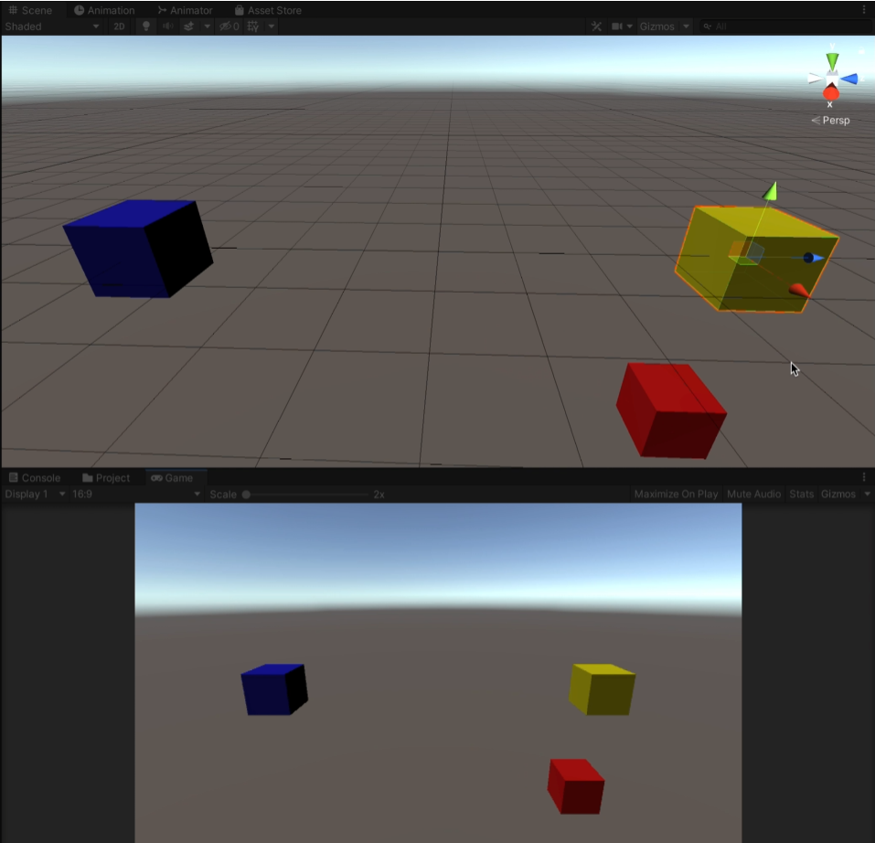

# Assignment 14.2: Application of Matrix Math and Linear Algebra

## Apply matrix math and linear algebra to transform objects in Unity.

Download the starter scene and import it into Unity. You should see three colored cubes. For this application assignment, edit the script attached to the redCube (TransformPosition) so that it oscillates between the two positions relative to the blueCube and the yellowCube. [See the screenshot to pinpoint the part of the script you will be working with.]

Without referencing the position of the blueCube or yellowCube, edit the script so the redCube oscillates between the bluePos and yellowPos and the redCube moves to three units above the blueCube and three units below the yellowCube.

After using the appropriate math to complete your script changes, run the game. Try moving either the blueCube or yellowCube around in your scene. If you complete this assignment correctly, the redCube’s movement should adjust to the new positions of the blueCube and yellowCube as seen in the video example below:

